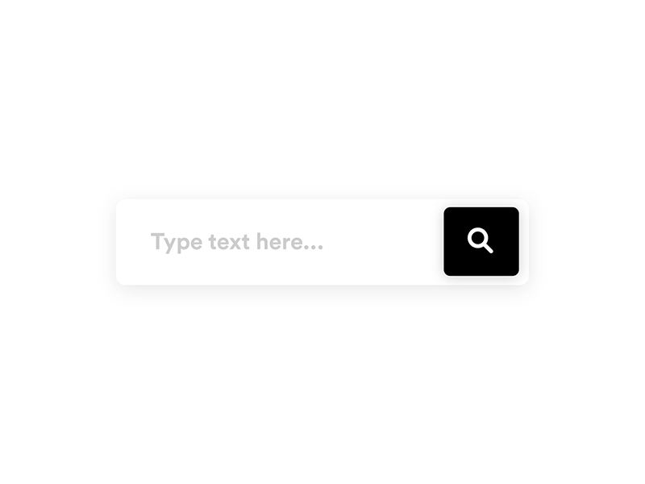
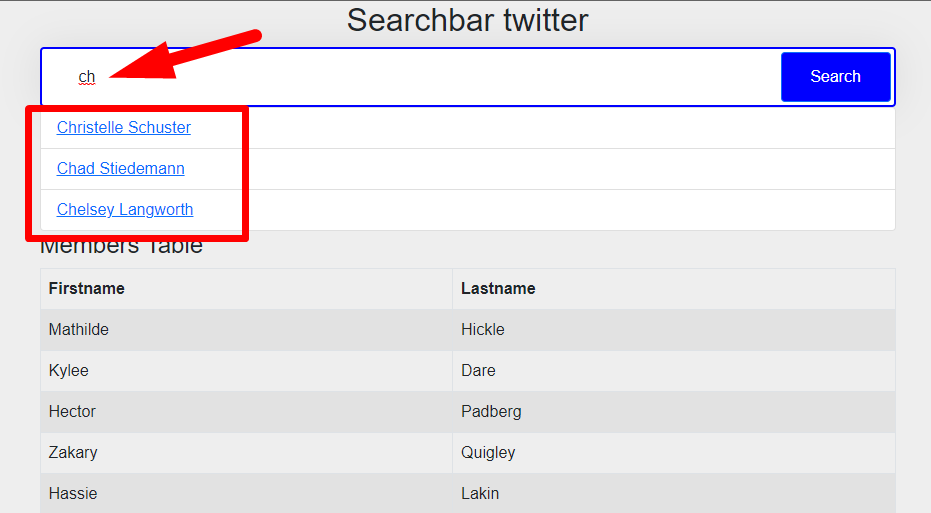
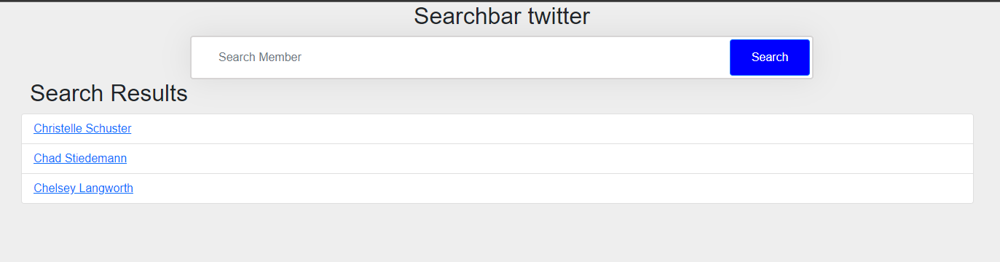

# Laravel Search Bar

## About project

A search bar that allows you to find the names of users or hashtags in real time without having to click on enter. The results can be displayed on a new page if you click on enter

## Used technology

-   Laravel 9
-   Bootstrap 4
-   jQuery

## Screenshots

